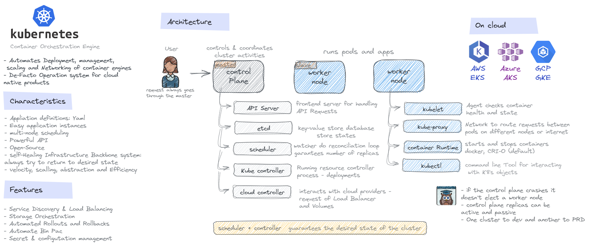
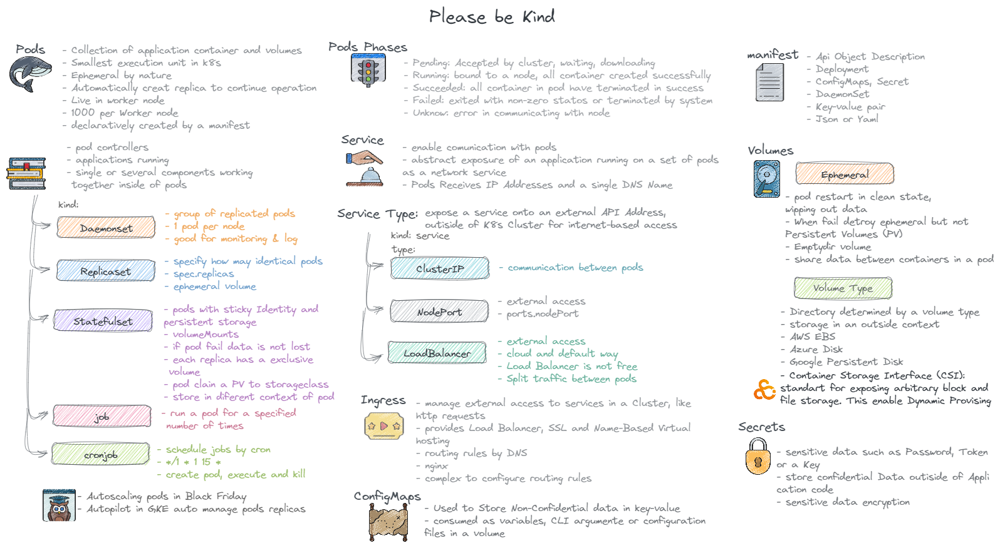

# K8s

- [Cheat sheet](https://kubernetes.io/pt-br/docs/reference/kubectl/cheatsheet/)
- [Basics](https://kubernetes.io/pt-br/docs/tutorials/kubernetes-basics/)

## Comands

- `kubectl version`

### Nodes

- `kubectl get nodes`

#### Additional information about each node in the cluster

- `kubectl get nodes -o wide`

### Pods

- `kubectl apply -f ./repository/yamls/templates/pod.yaml`
- `kubectl get pods`
- `kubectl describe pod podname`
- `kubectl exec podname -it -- /bin/sh`
- `kubectl logs podname`
- `kubectl delete pod podname`

### Daemonset

- `kubectl apply -f ./repository/yamls/templates/daemonset.yaml`
- `kubectl get daemonset`

### Replicaset

- `kubectl apply -f ./repository/yamls/templates/deployment.yaml`
- `kubectl get replicaset`

### Statefulset

- `kubectl apply -f ./repository/yamls/templates/statefulset.yaml`
- `kubectl get replicaset`
- `kubectl get pvc`
- `kubectl get pv`

### service

- `kubectl apply -f kappa_k8s_config/repository/yamls/templates/service.yaml`
- `kubectl get svc`

### storageclass

- `kubectl get storageclass`
- `kubectl describe sc standard`

### Tips

`imagePullPolicy: Always` toda vez que dar o apply vai pegar a versão mais recente da imagem

#### Listing and inspecting your cluster...helpful for knowing which cluster is your current context

kubectl cluster-info

#### Let's get a list of pods...but there isn't any running

kubectl get pods

#### True, but let's get a list of system pods. A namespace is a way to group resources together

kubectl get pods --namespace kube-system

#### Let's get additional information about each pod

kubectl get pods --namespace kube-system -o wide

#### Now let's get a list of everything that's running in all namespaces

#### In addition to pods, we see services, daemonsets, deployments and replicasets

kubectl get all --all-namespaces | more

#### Asking kubernetes for the resources it knows about

#### Let's look at the headers in each column. Name, Alias/shortnames, API Version

#### Is the resource in a namespace, for example StorageClass isn't and is available to all namespaces and finally Kind...this is the object type

kubectl api-resources | more

#### You'll soon find your favorite alias

kubectl get no

#### We can easily filter using group

kubectl api-resources | grep pod
