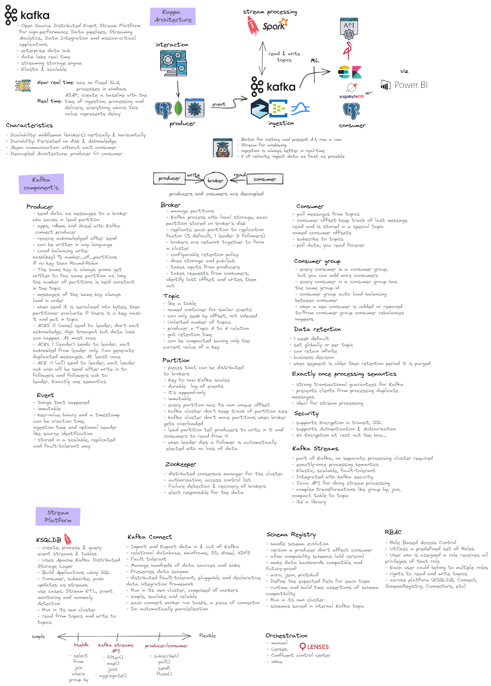

## Operator

strimzi

## namespace

ingestion

## What is Kafka

- Plataforma que possibilita o recebimento de enventos em tempo real e a entrega desses eventos em tempo real
- Criado em 2011 no LinkedIn, doado para Apache Foundation em 2011
- Um datalake em tempo real
- É uma engine de armazenamento, mas possui apis para inserção, leitura, processamento e integração com datastores
- Open Source Distributed Event Stream Plataform for high-performance Data pipelines, Streaming Analytics, Data Integration and mission-critical applications

## Caracteristicas

- Event driven
- Escalavel
- Distribuído
- Baixa latência
- Tolerância a falhas como perda de mensagens e eventos duplicados
- Ordenação garantida conforme a ordem de envio, essa ordenação é baseada em offset
- Trabalha com fila ordenada com tempo
- Consistencia, garantia da entrega da mensagem
- Exactly-once semantics: garantia de mensagens não tem perda de dados, duplicidade e mensagem é ordenada de acordo com o envio

### Broker

- Servidor principal do kafka, onde ficam as configurações de topico e partições
- É disk based gravando em formato binario

## Evento

- tudo o que acontece a todo momento, pode ser uma mensagem, um registro, uma transação etc.
- Tem tamanho máximo de 100mb

### Topico

- Onde o evento é gravado, semelhante a uma tabela
- Salvo no formato binário

### Retenção

- Tempo que o evento será armazenado no tópico até poder ser consumido
- Default 7 dias
- Pode ser retido infinitamente, mas não é uma boa prática pois fica caro
- Boa pratica é salvar o dado em um Data Lake no formato parquet após o periodo de retenção

### Particoes

- Um topico é reparticionado em inumeras partições
- Quanto mais topico, maior velocidade de leitura por poder alocar mais threads

### Replicação

- Alta disponibilidade garantida com replicação a nivel de topico
- Deve ser igual ou inferior a quantidade de brokers, ideal entre 3 e 8 no maximo
- Lider recebe o evento, followers recebem as replicas

### Security

- Consumidor e produtor comunica em plain text binario aberto, o que pode ser um problema de sugurança
- É possivel criptografar entre producer, Kafka e consumer on the fly com SSL e TLS
- É possivel usar autenticação (SSL e SASL) para cosumers e producers, o mais susado é usar SCRAM 512
- É possivel controlar a nivel de topico a leitura e escrita com Acess Control List (ACLs)

### Ingestion

- Trazer os dados das fontes para uma area analitica (staging area) para fazer desacoplamento, não realizar querys ad-hoc no transacional

### Integração

- Buscar os dados que foram inseridos em um banco de dados
- Apis mandam os dados para o Kafka e esse descarrega nos bancos

### Producer API

- produz os eventos e gravado em um segmento de uma partição de um tópico

  - Acks=0 manda e não aguarda retorno, pode haver perda de dados.
  - Acks=1 manda e aguarda retorno do Lider garantindo que chegou,pode ocorrer duplicidade de dados.
  - Acks=all manda evendo e aguarda retorno de lider e followers
  - Use Callback

### Consumer API

- Consumer: le os eventos do Kafka
- Offset: identificador numero da ultima posição lida
- Cria um consumer group, que contém offset e partição lida, todas as threads ficam no mesmo counsumer group

-

### Nomenclatura topico

output-ksqldb-stream-agent-avro
src-app-credit-card-avro
src-sqlserver-agent-json

### ACID

Apartir do Kafka 0.11

Atomicidade: Quando o produtor esta configurado para ter idepotência, o dado vai chegar ordenado e não duplicado. Broker realiza a deduplicação se por alguma razão ela vier do producer.

Consistência: Quando a transação ocorre ela não sobre alteração. Alcançado pelo particionamento. Toda vez que um id sofre alteração vai ser sempre alterado na mesma partição.

Isolamento: Isolamento pelo timestamp do evento, permitindo ordenação das transações

Durabilidade: Replicação em diferentes brokers garantes a disponibilidade

Retenção e Purge: retenção baseada em tempo. Pode ser aplicado a nivel de topico e a nivel de broker. 7 dias como default, mas da para colocar infinito.

Querys: não tem otimizador de plano de execução, mas é possivel utilizar KSQLDB, Trino, spark para otimizar a query

### Rebalance

### Kafka GUI

To manage topics, topics data, consumers group, schema registry, connect

- [Lenses](https://lenses.io/)
- [AKHQ](https://akhq.io/)

### Kafka Connect

- Producer e Consumer made easy
- Open Source
- Ler e gravar filesystem e banco de dados
- Jars do conector disponiveis no confluent hub para serem instalados no Kafka
- O arquivo de configuração utiliza a classe do conector para fazer a conexão
- Source: le de uma fonte de dados e traz para dentro do Kafka
- Sync: kafka para datastore

### Schema Registry

- A cada mudança de atributo é versionado o schema
- É possivel definir qual schema cada api ou source irá utilizar
