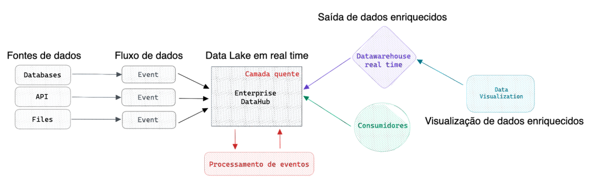
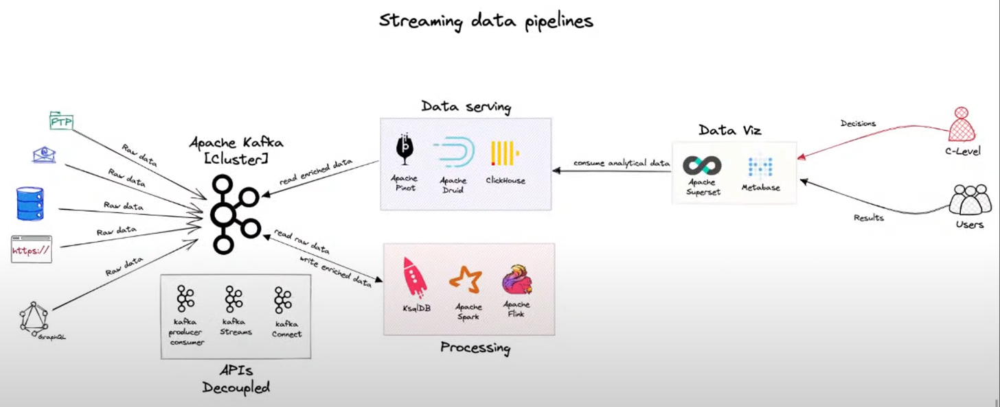

**AS-IS**

- ETL batch consome da source e disponibiliza no datalake

**TO-BE**

- Real time pipeline

**Requeriments**

- Low Latency
- Distributed
- Differrent sources
- Join different data stream
- Allow SQL
- Microservices Integration
- Full open-source
- Kubernetes

**Architecture**

- Kappa: arquitetura voltada para eventos, todos os dados são tratados como evento e aplicações podem consumir dados diretamente do event-sourcing.

- Nesta arquitetura, todos os dados sejam eles dentro de banco de dados, API ou arquivos são eventos, eventos são contínuos e imutáveis, dessa forma podemos colocar um sistema de enterprise datahub como sistema nervosos central da organização que recebe os eventos de diferentes fontes, processamos esses eventos em tempo real, e esses eventos podem ser consumidos por aplicações, inseridos em Data Warehouses específicos para garantir baixa latência para consultar esses eventos, e por fim o visualizador de dados acessa o DW para criação e atualização de dashboards. Os dados que estão em dentro do enterprise datahub podem ser inseridos dentro de um data lake para atender o times de machine learning por exemplo, o ideal é que todos os dados passem dentro do EDH para que o mesmo possa servir como integrador de eventos, grandes corporações utilizam esse método hoje para entrega em tempo real de analytics.
- Para uma pipeline ser considerar realtime não basta ter o Kafka na camada de ingestion, é necessário que todas tecnologias garantam Exactly-once semantics e tenham baixa latência fim-a-fim.

- O processamento é realizado sobre um tópico Kafka e o resultado é armazenado em outro tópico Kafka. Read raw data and write enriched data.
- Serving Layer lê de tópicos enriquecidos e disponibilizam em um formato tabular para a camada de data viz
