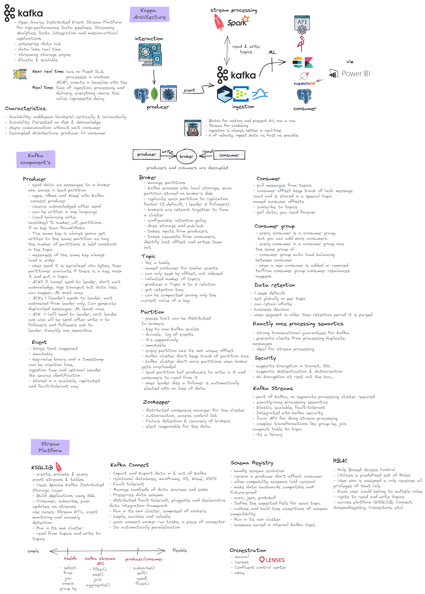

## Operator

strimzi

## namespace

ingestion

## What is Kafka



- Plataforma que possibilita o recebimento de enventos em tempo real e a entrega desses eventos em tempo real
- Criado em 2011 no LinkedIn, doado para Apache Foundation em 2011
- Um datalake em tempo real
- É uma engine de armazenamento, mas possui apis para inserção, leitura, processamento e integração com datastores
- Open Source Distributed Event Stream Plataform for high-performance Data pipelines, Streaming Analytics, Data Integration and mission-critical applications
- Pure distributed log designed for efficient event streaming at high-scale

## Caracteristicas

- Event driven
- Scalability: middleman, scale vertically and horizontally
- Durability: Persisted On-disk & acknowledged
- Async communication: without waiting consumer
- Decoupled Architecture: producer <> consumers, storage <> processing
- Distribuído
- Baixa latência
- Tolerância a falhas: perda de mensagens e eventos duplicados
- Ordenação garantida conforme a ordem de envio, essa ordenação é baseada em offset
- Trabalha com fila ordenada com tempo
- Consistencia, garantia da entrega da mensagem
- Exactly-once semantics: garantia de mensagens não tem perda de dados, duplicidade e mensagem é ordenada de acordo com o envio
- Veio solucionar o V de velocidade do big data
- ingest data as fast as possible
- Streaming Platform (message broker)
- can be CP, CA, AP
- Comsumption mode: Pull
- Storage Archtecture: Log


## Evento

- tudo o que acontece a todo momento, pode ser uma mensagem, um registro, uma transação etc.
- Tem tamanho máximo de 100mb

### Topico

- Onde o evento é gravado, semelhante a uma tabela
- Salvo no formato binário

### Particoes

- Um topico é reparticionado em inumeras partições
- Quanto mais topico, maior velocidade de leitura por poder alocar mais threads

### Producer API

- produz os eventos e gravado em um segmento de uma partição de um tópico

  - Acks=0 manda e não aguarda retorno, pode haver perda de dados.
  - Acks=1 manda e aguarda retorno do Lider garantindo que chegou,pode ocorrer duplicidade de dados.
  - Acks=all manda evendo e aguarda retorno de lider e followers
  - Use Callback

### Consumer API

- Consumer: le os eventos do Kafka
- Offset: identificador numero da ultima posição lida
- Cria um consumer group, que contém offset e partição lida, todas as threads ficam no mesmo counsumer group

### Broker

- Servidor principal do kafka, onde ficam as configurações de topico e partições
- producers gravam eventos nas partiçoes de um topico leader no broker
- É disk based gravando em formato binario


### Retenção

- Tempo que o evento será armazenado no tópico até poder ser consumido
- Default 7 dias
- Pode ser retido infinitamente, mas não é uma boa prática pois fica caro
- Boa pratica é salvar o dado em um Data Lake no formato parquet após o periodo de retenção

### Replicação

- Alta disponibilidade garantida com replicação a nivel de topico
- Deve ser igual ou inferior a quantidade de brokers, ideal entre 3 e 8 no maximo
- Lider recebe o evento, followers recebem as replicas


### Ingestion

- Trazer os dados das fontes para uma area analitica (staging area) para fazer desacoplamento, não realizar querys ad-hoc no transacional

### Integração

- Buscar os dados que foram inseridos em um banco de dados
- Apis mandam os dados para o Kafka e esse descarrega nos bancos

### Kafka Connect

- Producer e Consumer made easy
- Open Source
- Ler e gravar de filesystem e banco de dados
- Jars do conector disponiveis no confluent hub para serem instalados no Kafka
- O arquivo de configuração utiliza a classe do conector para fazer a conexão
- Source: from fonte de dados to Kafka, producer
- Sync: kafka para datastore, consumer

### Nomenclatura topico

output-ksqldb-stream-agent-avro
src-app-credit-card-avro
src-sqlserver-agent-json

### ACID

Apartir do Kafka 0.11

Atomicidade: Quando o produtor esta configurado para ter idepotência, o dado vai chegar ordenado e não duplicado. Broker realiza a deduplicação se por alguma razão ela vier do producer.

Consistência: Quando a transação ocorre ela não sobre alteração. Alcançado pelo particionamento. Toda vez que um id sofre alteração vai ser sempre alterado na mesma partição.

Isolamento: Isolamento pelo timestamp do evento, permitindo ordenação das transações

Durabilidade: Replicação em diferentes brokers garantes a disponibilidade

Retenção e Purge: retenção baseada em tempo. Pode ser aplicado a nivel de topico e a nivel de broker. 7 dias como default, mas da para colocar infinito.

Querys: não tem otimizador de plano de execução, mas é possivel utilizar KSQLDB, Trino, spark para otimizar a query

### Kafka GUI

To manage topics, topics data, consumers group, schema registry, connect

- [Lenses](https://lenses.io/)
- [AKHQ](https://akhq.io/)

### Schema Registry

- A cada mudança de atributo é versionado o schema
- É possivel definir qual schema cada api ou source irá utilizar

### Security

- Consumidor e produtor comunicam em plain text binario aberto, o que pode ser um problema de sugurança
- É possivel criptografar entre producer, Kafka e consumer on the fly com SSL e TLS
- É possivel usar autenticação (SSL e SASL) para cosumers e producers, o mais susado é usar SCRAM 512
- É possivel controlar a nivel de topico a leitura e escrita com Acess Control List (ACLs)
- Authentication: verify the identity of the components with which they're communicating: Client-broker; broker-broker; zookeeper-broker
  - every connection has a Kafka principal, when authentication has not been enable this principal is anonymous
  - security protocols: SSL and SASL_SSL
  - listener: host and port where you can apply security protocols
  - SSL broker configuration: `ssl.client.auth=required` broker will now verify the client certificate in order to confirm the client's identity
  - SASL_SSL when you want to integrate Kafka with an existing Kerberos server, such as Active Directory or OpenLDAP
  - use filesystem permission to restrict access to files containing security information
  - Avoid storing passwords in plaintext
  - use disk encryption or a secure credential store
  - use quotas to limit the impact of malicious client behaviours
  - apply change control to configuration
- Authorization: determines what an identity is permitted to do on the system once it has been authenticated
  - Access Control Lists: describes wich users are permitted to perform certain operations on specific resources and wich users are denied permissions
  - user: Alice(principal) has allow (permission type) permission for write (operation) to Topic:customer (resource type and name)
  ```
  kafka-acls --bootstrap-server localhost:9092 \
  --command-config adminclient-configs.conf  \
  --add \
  --allow-principal User:alice \
  --allow-principal User:fred \
  --operation read 
  --operation write \
  --topic finance`
  ```
  - use super users and allow.everyone.if.no.acl.found not at all
  - Don't grant access to ANONYMOUS principal
  - Automate the process of creating user credential and assigning ACLs for all environments
  - Adjust connections.max.reauth.ms to force connection to reauthenticate at intervals
  - use deny ACLs to prevent actions from compromised users
