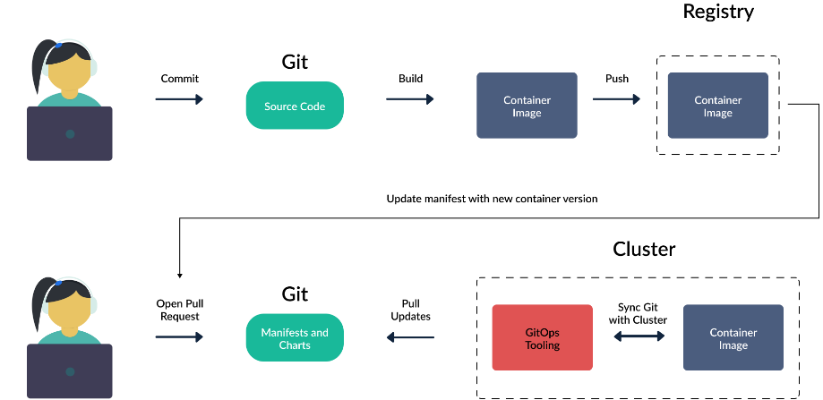

## What is

GitOps is a set of best practices where the entire code delivery process is controlled via Git, including infrastructure and application definition as code and automation to complete updates and rollbacks.
GitOps is about running operations out of Git by pull requests with goal of continuos delivery of cloud native app insfrastructure typically to Kubernetes

## The Key GitOps Principles

- The entire system (infrastructure and applications) is described declaratively.
- The canonical desired system state is versioned in Git.
- Changes approved are automated and applied to the system.
- Software agents ensure correctness and alert on divergence.

## Flow

1. A GitOps agent is deployed on the cluster.
2. The GitOps agent is monitoring one or more Git repositories that define applications and contain Kubernetes manifests (or Helm charts or Kustomize files).
3. Once a Git commit happens the GitOps agent is instructing the cluster to reach the same state as what is described in Git.
4. Developers, operators. and other stakeholders perform all changes via Git operations and never directly touch the cluster (or perform manual kubectl commands).

## Key points here are

- The state of the cluster is always described in Git. Git holds everything for the application and not just the source code.
- There is no external deployment system with full access to the cluster. The cluster itself is pulling changes and deployment information.
- The GitOps controller is running in a constant loop and always matches the Git state with the cluster state.

## Pros of GitOps

- Faster deployments
- Safer deployments
- Easier rollbacks and low Mean Time to Recover
- Straightforward auditing
- Better traceability
- Eliminating configuration drift
- Developer Centric
- Secure
- Self Documented code
- Increase Stability & Reability

## Chalanges of GitOps

- Teams will have to adjust their culture and way of working to support using Git as the single source of truth
- All changes will be committed, this may present a challenge when it comes to debugging a live environment where operators are used to connecting and using a terminal to make changes on the fly

## Prerequisites for adopting GitOps

- Good testing and CI already in place
- A strategy for dealing with promotions between environments (something will cover in later certifications)
- Secrets strategy

## Use cases

- Continous delivery of application Configurations: tipically to the Kubernetes enviroment in form of yaml manifests, helm chart, kustomized codes. Includes deployments, service configuration, load balancer, replicasets, configmaps, secrets, ingress etc.
- Apply release strategies like blue/green, rolling update, canary, progressing releases
- Infrastructure rollouts to Kubernetes
- Disaster Recovery: recover from a failure quickly
- Sync Secrets
- Drift Dection: Notify or Reconcile manual changes in cluster
- Deploy to Multiple Kubernetes Clusters
- Securely handoff Deployments to Devs: no cluster access to devs, CI not acess CD and multi Tenancy
- Auto Update Kubernetes YAMLs on new image in Registry (only on FluxCD)

## Tools

- JenkinsX: CI + CD
- ArgoCD: Nice UI and easy to use
- FluxCD : Automatic Image Updates
